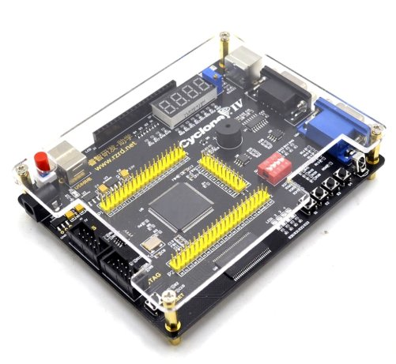

# Altera-Cyclone-IV-board-V3.0
Documentation for relatively cheap Chinese ALTERA Cyclone IV EP4CE6 FPGA Development Board

## Slithy Games Fork!

Here's where you can find all the additional information gathered by Matt Heffernan,
[as seen on YouTube](https://www.youtube.com/playlist?list=PLPSrOWYluVLJxqlrWqjZWQ1B4bBgrQ42G)

## Where to Buy
* [Wish](https://www.wish.com/product/5e9449ea6dc97982b2160d2c?share=web)
* [AliExpress](https://www.aliexpress.com/item/32868368072.html)

## Other Helpful Resources
* [Software Download](https://www.intel.com/content/www/us/en/collections/products/fpga/software/downloads.html?s=Newest)
* [USB rules for Linux](https://community.intel.com/t5/Intel-Quartus-Prime-Software/Quartus-II-JTAG-Server-Error-Code-89/td-p/162221)
